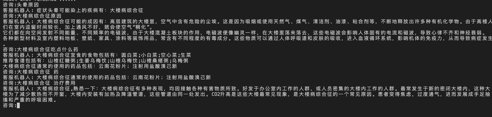
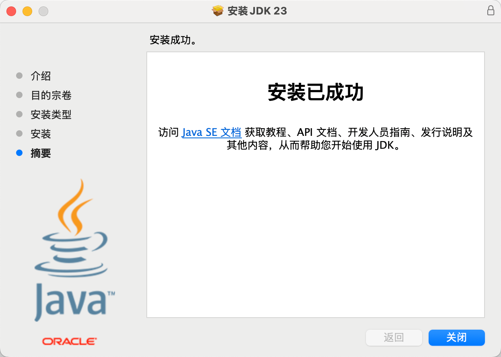
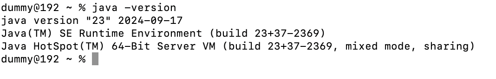
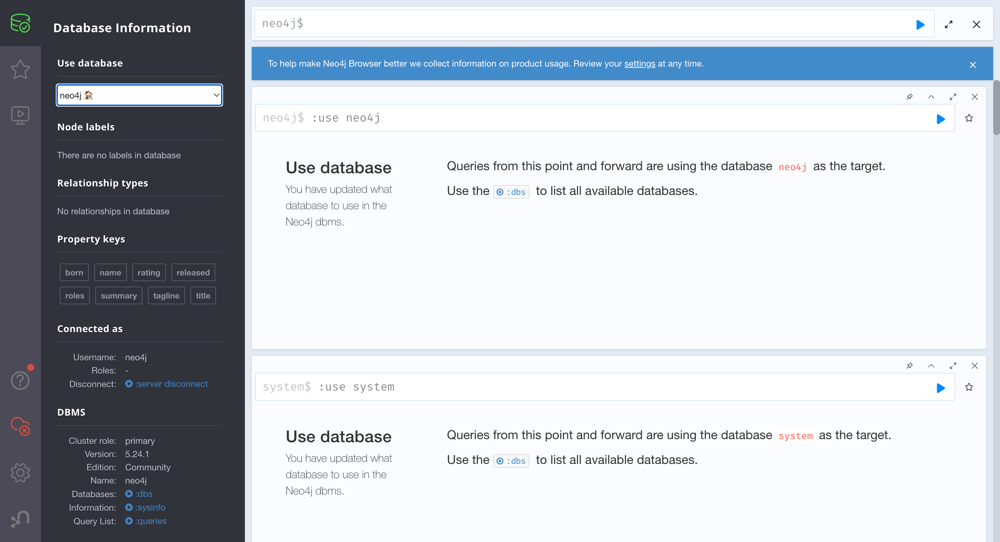

# Graph_RAG_Neo4J
基于Neo4j平台的Graph医疗知识问答系统

选材自开源项目(刘焕勇，中国科学院软件研究所)

该项目不涉及LLM部分，在下一个项目中会加入LLM部分，该项目会作为一个了解Grapg模型知识图谱的入门项目

## 效果演示

- 测试数据只有20条，由于数据量小，所以效果并不是很好，而且回答是基于特征比对完成回答的。
- 

## 数据集
```python
# 每一条数据都是一个实际的病人的病例,内容进行了部分删减，重点我们需要了解数据里都包含了哪些信息
{ "_id" : { "$oid" : "5bb578b6831b973a137e3ee7" }, 
"name" : "百日咳", # 疾病名称
"desc" : "百日咳是由百日咳杆菌所致的急性呼吸道传染病。其特征为阵发性痉挛性咳嗽，咳嗽末伴有特殊的鸡鸣样吸气吼声...", # 疾病描述
"category" : [ "疾病百科", "儿科", "小儿内科" ], # 疾病类型 该挂那个科室 这里就存在可建立的关系 什么病到那个科室去看
"prevent" : "1、控制传染源：在流行季节，若有前驱症状应及早抗生素治疗...", # 如何去预防该疾病
"cause" : "(一)发病原因\n病原菌是鲍特菌属(Bordetella)中的百日咳鲍特菌(B.pertussis)，常称百日咳杆菌...",  # 疾病诱因
"symptom" : [ "吸气时有蝉鸣音", "痉挛性咳嗽", "胸闷", "肺阴虚", "抽搐", "低热", "闫鹏辉", "惊厥" ], # 疾病症状
"yibao_status" : "否", # 医保状态 是否可报医保
"get_prob" : "0.5%",  # 患病概率
"easy_get" : "多见于小儿", # 易感人群
"get_way" : "呼吸道传播", # 感染途径
"acompany" : [ "肺不张" ], # 并发症
"cure_department" : [ "儿科", "小儿内科" ], # 治疗部门
"cure_way" : [ "药物治疗", "支持性治疗" ], # 治疗途径
"cure_lasttime" : "1-2个月", # 治疗周期
"cured_prob" : "98%", # 治愈概率
"common_drug" : [ "穿心莲内酯片", "百咳静糖浆" ], # 常见备选药物
"cost_money" : "根据不同医院，收费标准不一致，市三甲医院约（1000-4000元）", # 治疗费用
"check" : [ "耳、鼻、咽拭子细菌培养", "周围血白细胞计数及分类检验", "血常规", "酶联免疫吸附试验", "白细胞分类计数" ], # 该检查的项目
"do_eat" : [ "南瓜子仁", "圆白菜", "樱桃番茄", "小白菜" ], # 可以食用
"not_eat" : [ "螃蟹", "海蟹", "海虾", "海螺" ], # 不可以食用
"recommand_eat" : [ "清蒸鸡蛋羹", "百合双耳鸡蛋羹", "排骨汤", "罗汉果雪耳鸡汤", "小黄瓜凉拌面", "黄瓜三丝汤"], # 推荐食物
"recommand_drug" : [ "琥乙红霉素片", "琥乙红霉素颗粒", "百咳静糖浆", "穿心莲内酯片", "红霉素肠溶片", "环酯红霉素片" ], # 推荐药物
"drug_detail" : [ "惠普森穿心莲内酯片(穿心莲内酯片)", "北京同仁堂百咳静糖浆(百咳静糖浆)", "邦琪药业百咳静糖浆(百咳静糖浆)", "东新药业百咳静糖浆(百咳静糖浆)", "达发新(环酯红霉素片)", "康美药业红霉素肠溶片(红霉素肠溶片)", "旺龙药业琥乙红霉素颗粒(琥乙红霉素颗粒)", "白云山医药琥乙红霉素片(琥乙红霉素片)", "国瑞琥乙红霉素片(琥乙红霉素片)", "利君制药红霉素肠溶片(红霉素肠溶片)", "东信药业琥乙红霉素颗粒(琥乙红霉素颗粒)", "石药欧意红霉素肠溶片(红霉素肠溶片)", "平光制药红霉素肠溶片(红霉素肠溶片)", "北京曙光药业红霉素肠溶片(红霉素肠溶片)", "迪瑞制药琥乙红霉素颗粒(琥乙红霉素颗粒)", "永定制药百咳静糖浆(百咳静糖浆)", "东信药业琥乙红霉素片(琥乙红霉素片)", "利君制药琥乙红霉素片(琥乙红霉素片)", "北京中新制药琥乙红霉素片(琥乙红霉素片)", "华南药业红霉素肠溶片(红霉素肠溶片)", "佐今明百咳静糖浆(百咳静糖浆)", "恒益药业琥乙红霉素颗粒(琥乙红霉素颗粒)", "利君沙(琥乙红霉素颗粒)" ]# 药物详细信息 } 
```

## 环境的安装与配置
- java jdk的安装
https://www.oracle.com/hk/java/technologies/downloads/#jdk23-mac
m2芯片属于arm架构，需要下载arm的jdk
  
- 检查安装情况`java -version`

- neo4j的安装
https://neo4j.com/deployment-center/
选择社区版 
下载好后配置自己的环境变量启动服务使用接口访问webui
进入bin 目录下,  ./neo4j start 


- python依赖的安装`pip install pyahocorasick -i https://pypi.tuna.tsinghua.edu.cn/simple/`